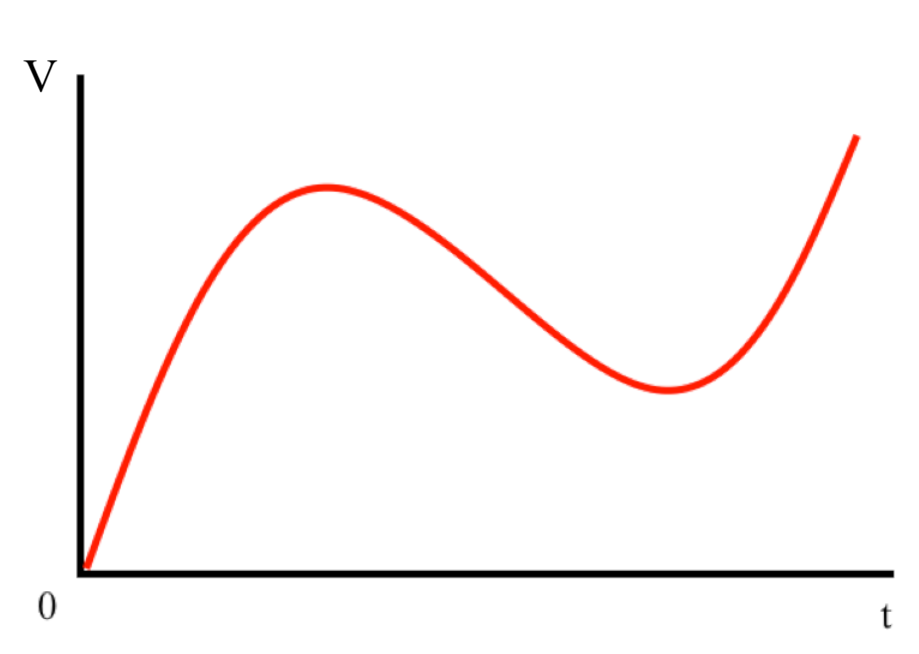
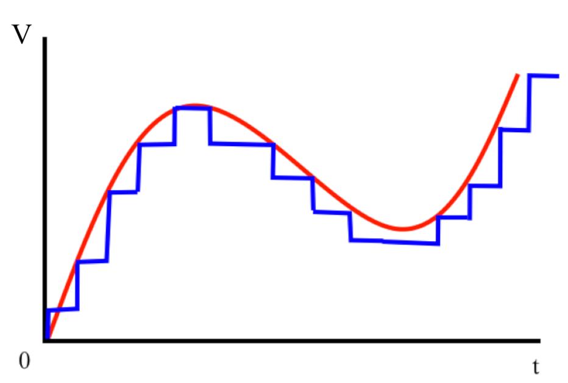
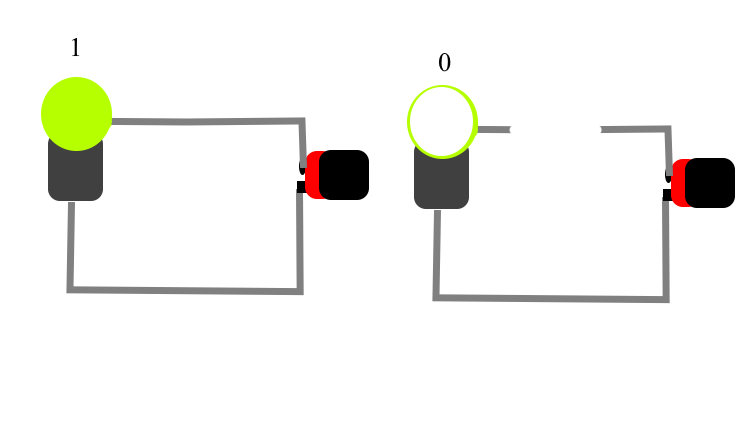
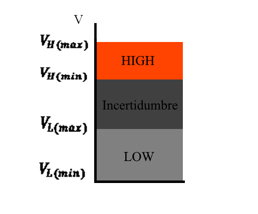
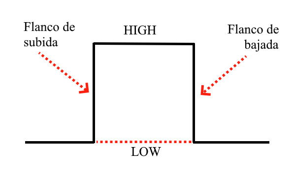
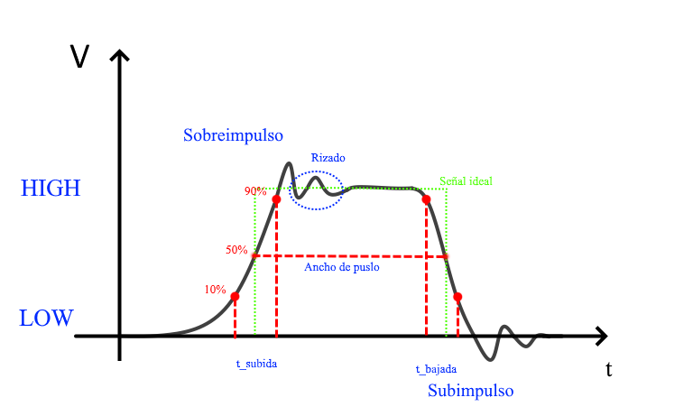

> ✍🏻 **Autor:** Lulo  
> 📚 **Nivel:** Fácil  
> ⌛ **Tiempo lectura:** 10-15 min  
> 🧮 **Matemáticas:** Básicas  
{{ mostrar_etiquetas() }}

---

# Señal Continua y discreta

El elemento más básico e importante en la electrónica es el **electrón**. Este, al desplazarse por los diferentes materiales hace que surja la **intensidad**, pero para que exista este movimiento tenemos algo que llamaremos  **voltaje** o **tensión**: esta puede ser grande, pequeña o negativa. Esta variación, si la medimos a lo largo del tiempo, conseguiremos una **amplitud**. Si en vez de ser constante, cambia, conseguimos una **señal continua**, como podemos ver en la [Figura 1](#figura1), que es la base de la electrónica analógica.

El trabajar este tipo de señales es muy difícil de procesar y almacenar. Son necesarios grandes aparatos que generalmente requieren muchas horas para poderlos programar. Esto surge por el hecho que trabajamos con "la señal completa". Una solución es medir cada cierto tiempo -llamado **periodo**- la tensión que hay en ese instante. De esta manera, tenemos una **señal discreta**, que son las que usan nuestros ordenadores, móviles o dispositivos electrónicos en general.

  
   
  <em>Fig 1. Ejemplo de señal continua</em>

 

Imaginemos una señal como la [Figura 1](#figura1). En el eje vertical tenemos **la amplitud**, que representaremos con la letra $V$, y en el horizontal el **tiempo**, mostrado con $t$. Al recorrer el eje del tiempo vemos que la señal ha ido cambiando su valor de amplitud. Esto es porque es una señal variable.

  
   
  <em>Fig 2. Señal discretizada sobre Señal continua</em>

 

Ahora vamos a **discretizarla**. Tomamos un periodo $T$, que es una cantidad de tiempo fija, y medimos $V$ cada dicho $T$. Esto genera unos puntos que, si los unimos con rectas horizontales y verticales, nos queda algo parecido a una escalera, mostrado en la [Figura 2](#figura2). La nueva señal creada se termina pareciendo a la señal original, aunque cuanto más reduzcamos el periodo de muestra $T$ menos error tenemos y más similares resultan. De esta forma, hemos **digitalizado** una señal mediante la **discretización**. Con este método podemos convertir cualquier señal analógica a digital.

# El 0 y el 1

Para que un ordenador pueda entender bien la información, el usar señales analógicas digitalizadas le pueden llegar a ser demasiado complicadas, por lo que hace falta simplificarlas. Para ello, vamos a tener dos tensiones de partida, voltaje bajo $V_L$ y voltaje alto $V_H$. Para entenderlo mejor, montamos un circuito simple, de solo una fuente y un bombillo, representado en la [Figura 3](#figura3). Vamos a imaginarnos que la fuente, una simple pila, da $V_H$ cuando el cable está conectado, y cuando no está conectado, como no existe un circuito cerrado, pues da $V_L$.

  
   
  <em>Fig 3. Ejemplo empleando un circuito sencillo. Izquierda en $V_H$. Derecha en $V_L$</em>

 

Para poder trabajar con estos conceptos, en vez de usar este dibujo, vamos a apoyarnos en las matemáticas transformando estos estados a que cuando esté encendido el bombillo equivale a un 1, y si está apagado a un 0. De manera muy superficial, este es el abecedario de los ordenadores, con el que ellos pueden "pensar".

Como punto final, estaría bien que aclarase que para que un circuito pueda tener en funcionamiento este 1 y 0, se usan tensiones con <u>valores típicos de 5V o 3.3V a 0V</u>.

  
   
  <em>Fig 4. Rangos de tensión de señal electrónica</em>

 

Volviendo al uso de las tensiones, en la [Figura 4](#figura4) se puede ver una representación en la que se marcan el voltaje alto $V_H$ y bajo $V_L$. Como no son señales perfectas, ya que aparece un cierto **ruido** que hace que la señal oscile próximo al valor deseado, pues se presenta un cierto rango, comprendido en máximo $V_{\text{max}}$ y mínimo $V_{\text{min}}$. Entre estas tensiones máximas y mínimas se consiguen los rangos **High** y **Low**, alto y bajo respectivamente. Cuando se pasa de $V_{\text{H(min)}}$ a $V_{\text{L(max)}}$ aparece algo llamado **incertidumbre**. Toda tensión que se encuentre en esa zona será "ignorada" por el circuito, deshaciéndose de ruidos de gran amplitud.

# Señal binaria

La representación numérica es la más cómoda para que un humano pueda trabajar con una máquina, pero esta no funciona exactamente así. Antes de pasar a cómo trabajar matemáticamente el binario, vamos a profundizar un poco más en las señales que entiende la electrónica.

## Señal ideal

Retomando la señal discretizada, tenemos *high* y *low*. Si se hace que la señal alterne entre estos dos valores y se toma una foto de uno de estos instantes, se obtiene una especie de caja, como se representa en la [Figura 5](#figura5).

  
   
  <em>Fig 5. Constitución de una señal digital ideal</em>

 

Volviendo a la [figura anterior](#figura5), recorriendo de izquierda a derecha, se parte del valor *low* y, en un instante $t$, se pasa a *high*. A este salto se le da el nombre de **flanco de subida**. Al seguir avanzando, vuelve a surgir otro paso de *high* a *low*. Igual que en salto anterior, esto es un **flanco de bajada**.

Estas serían las principales partes que conforman una **señal digital idealizada**.

## Señal real

Cuando pasamos al caso real, a medir lo que pasa por el circuito y trabajan los componentes electrónicos, pues existen algunas diferencias.

  
   
  <em>Fig 6. Constitución de una señal digital real</em>

 

Partiendo de la señal ideal, se vuelve a estudiar la parte que se pasa de bajo a alto. En este nuevo ejemplo, mostrado en la [Figura 6](#figura6), al cambiar de estado, en vez de hacerse de forma inmediata, surge una pendiente. Esto es porque existen efectos capacitivos que no se tenían en cuenta en el caso ideal. Estos efectos lo que hacen es que la subida sea lenta y se empieza a tomar que está en el estado *high* cuando ha superado el 90% de la tensión. El tiempo que se tarda de pasar del 10% al 90% tiene el nombre de **tiempo de subida**. Para el flanco de bajada tiene su equivalente, el **tiempo de bajada**.

Cuando cambia al nuevo estado, no se estabiliza la señal de inmediato, sino aparece una "inercia" que le hace aumentar un poco más de lo que debería. El punto más alto se llama **sobreimpulso**. Al intentar alcanzar el estado deseado, empieza a haber una oscilzación, que es el **rizado**, estos dos fenómenos suceden cuando cambiamos de un estado al otro, aunque el pico que aparece después de un flanco de bajada en realidad se le conoce como **subimpulso**. 

Otro valor interesante es el **ancho de pulso**, que es cuando cada flanco se encuentra en el 50% de su recorrido. Este sería el equivalente en el caso ideal del tiempo de pulso.

---

Estos serían los conceptos básicos de la comunicación digital. El problema es que si constantemente usamos señales para trabajar la electrónica, se volvería demasiado difícil, por lo que se hace una simplificación matemática, la misma hablada anteriormente, la representación en binario, que profundizaremos en ella a lo largo de las siguientes publicaciones.

---
